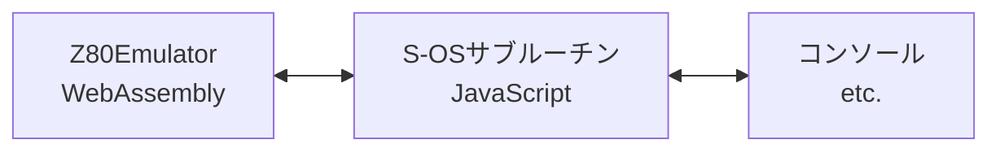

# S-OS"SWORD" for Web

S-OS"SWORD"を、WebAssemblyとJavaScriptで動くようにしたものです。  
Z80エミュレート等のハード部分をWebAssemblyでS-OS"SWORD"のサブルーチン部分や表示などは、JavaScriptで実装しています。

## メモリマップ

64KiBのメモリを持たせています。

| Address | Description |
| --- | --- |
| 0000h~000Bh | 起動用コード、制御用コード |
| 0100h~017Fh | S-OSサブルーチンのフック用 |
| 0180h~019Fh | S-OS IBバッファ |
| 01A0h~01A1h | カーソル位置 |
| 0200h~02FFh | キーボード入力バッファ |
| 0300h~03FFh | FAT用バッファ |
| 0400h~04FFh | セクタデータ読み込み用バッファ |
| 0500h~07FFh | スタックエリア |
|  | 空き |
| 1F00h~2040h | S-OSサブルーチンのフック、ワーク |
| 2B00h~2B06h | S-OSサブルーチンのフック、ワーク |
| 2B07h~FFFFh | 空き |

### 特殊メモリエリア

容量は64KiBで、Z80から見えない所にあります。  
「S-OS #POKE」や「S-OS #PEEK」などでアクセスできます。

## I/Oポートのマップ

64Kエントリのポートがあります。

| Port | Description |
| --- | --- |
| 10xxh b 11xxh r 12xxh g | X1のグラフィックパレット ※未テスト |
| 1Bxxh data 1Cxxh reg. | PSG ※未テスト |
| 1FA0h 1FA1h 1FA2h 1FA3h | Z80 CTC |
| 4000h~FFFFh | X1のグラフィックVRAM |

- PSG 入力4MHz
- Z80 CTC
  - 入力4MHz
  - ch0 のTRGはch3に接続
  - ch1、ch2のTRGは2MHz

## S-OS モニタ

S-OS標準のモニタです。

### コマンド

- 工事中...

## プラットフォーム固有のモニタ

プラットフォーム固有のモニタです。  
S-OS標準モニタの「M」コマンド、もしくは、S-OS #MONで起動します。

### コマンド

- 工事中...

# Demo

デモ https://w88dodpecuthlol.github.io/SOS_SWORDforWeb/

# ライセンスについて

- 「LICENSE.md」を見てください。

# To do list

- ソース整理
- ドキュメントを書く
- S-OSの標準のモニタ
  - 各種コマンドの実装とテスト
- BIOS部分の実装とテスト

# 実装状況

- S-OS #VER 仮で機種を78hにしている
- ~~S-OS #MON 実装中~~
- ~~S-OS #PAUSE 未テスト~~
- ~~S-OS #BELL 未実装~~ **猫のセンスの無さゆえに、断念**
- ~~S-OS #WOPEN 未テスト~~
- ~~S-OS #INP、#OUT 未実装。仕様不明。共通I/Oポートとは何だろう？~~ S-OS側も未実装っぽいからOK？
- S-OS標準モニタ Mコマンド（各機種のモニタ） 実装中
- ~~S-OS標準モニタ !コマンド（ブート）未実装~~
- ~~S-OS標準モニタ 空白＋<ファイル名>~~  
  ~~バッチファイルの方、未テスト~~
- ~~S-OS標準モニタ Pコマンド（ポーズ）未実装~~

# 参考

- PC-6001mkII/6601/SR用S-OS"SWORD" http://000.la.coocan.jp/p6/sword/index.html
- THE SENTINEL http://www.retropc.net/ohishi/s-os/
- Ｓ－ＯＳ　ＳＷＯＲＤ　Ｖｅｒ．２．０ http://www43.tok2.com/home/cmpslv/Unk/SOS/S-OS%20Sword%20Ver2.0%20(J)(1986-02)(Oh!mz)%20[mz80K][type-in].txt
- HuDisk ディスクイメージ操作ツール https://github.com/BouKiCHi/HuDisk
- その他、多数
