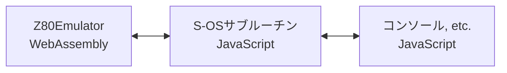

# S-OS"SWORD" for Web

S-OS"SWORD"を、WebAssemblyとJavaScriptで動くようにしたものです。  
Z80エミュレート等のハード部分をWebAssemblyでS-OS"SWORD"のサブルーチン部分や表示などは、JavaScriptで実装しています。

## Demo

|    |  URL  |  備考  |
| ---- | ---- | ---- |
|  デモ  | https://w88dodpecuthlol.github.io/SOS_SWORDforWeb/ |  |
|  デモ PC8001風フォントマップ | https://w88dodpecuthlol.github.io/SOS_SWORDforWeb/?fnt=PC8001 | PC8001用のフォントマップ |
| AFTER BUNER II | https://w88dodpecuthlol.github.io/SOS_SWORDforWeb/?exec=sample/AFTER_BUNER_S.obj | ぼや様(@boyahina)ご提供 |
| MISSILE COMMANDER | https://w88dodpecuthlol.github.io/SOS_SWORDforWeb/?exec=sample/MIS_COMMANDER.obj | ぼや様(@boyahina)ご提供 |
| 大富豪 | https://w88dodpecuthlol.github.io/SOS_SWORDforWeb/?fnt=PC8001&exec=sample/RICH_OR_POOR.obj | ぼや様(@boyahina)ご提供 |

※「AFTER BUNER II」「MISSILE COMMANDER」「大富豪」は、ぼや様(@boyahina)からご提供頂きました。  
無断転載禁止とのことですので、扱いにはご注意ください。詳しくは ⇒ https://negi.moe/sos/

## 使い方

### フロッピーディスク

ディスクイメージは、2DメディアのD88形式、または、ヘッダが無い生のイメージ(拡張子が2Dでファイルサイズ327680バイト)が利用可能です。  
※ @todo 説明追記

また、S-OSヘッダ（18バイト）があるファイルを直接読み込み実行できます。

#### S-OSヘッダについて  

ヘッダは18バイトで、マジックナンバー、属性、読み込み先頭アドレス、実行アドレスが順に格納される。  
末尾は0x0A。C言語風には"_SOS 01 3000 3000\x0A"みたいな文字列になる。  
　``_``SOS : マジックナンバー。  "``_``"は0x5F。  
　01 : 属性(ファイルモード)。16進2桁。01はバイナリファイル。04はアスキーファイル  
　3000 : 読み込み先頭アドレスを16進4桁で（バイナリファイルのみ有効）  
　3000 : 実行アドレスを16進4桁で（バイナリファイルのみ有効）

| 位置   |  サイズ  |  内容、備考など  |
| ---- | ---- | ---- |
| +0 | 4バイト | ヘッダ 0x5F,0x53,0x4F,0x53 "_SOS" |
| +4 | 1バイト | 区切り文字(0x20) |
| +5 | 2バイト | 属性（ファイルモード） 16進2桁 "01" : バイナリファイル "04" : アスキーファイル |
| +7 | 1バイト | 区切り文字(0x20) |
| +8 | 4バイト | 読み込み先頭アドレス 16進4桁 |
| +12 | 1バイト | 区切り文字(0x20) |
| +13 | 4バイト | 実行アドレス 16進4桁 |
| +17 | 1バイト | 終端文字(0x0A) |

このヘッダの後に、バイナリ本体が続く。

### サウンドを再生有効に

サウンドを再生有効にするには、右下にある音量のアイコンをクリックします。

# 内部的なこと

## メモリマップ

64KiBのメモリを持たせています。

| Address | Description |
| --- | --- |
| 0000h~000Bh | 起動用コード、制御用コード |
| 0100h~017Fh | S-OSサブルーチンのフック用 |
| 0180h~019Fh | S-OS IBバッファ |
| 01A0h~01A1h | カーソル位置 |
| 0200h~02FFh | キーボード入力バッファ |
| 0300h~04FFh | FAT用バッファ(256バイトx2) |
| 0500h~05FFh | セクタデータ読み込み用バッファ |
| 0600h~07FFh | スタックエリア |
|  | 空き |
| 1F00h~2040h | S-OSサブルーチンのフック、ワーク |
| 2B00h~2B06h | S-OSサブルーチンのフック、ワーク |
| 2B07h~FFFFh | 空き |

### 特殊メモリエリア

容量は64KiBで、Z80から見えない所にあります。  
「S-OS #POKE」や「S-OS #PEEK」などでアクセスできます。

## I/Oポートのマップ

64Kエントリのポートがあります。

| Port | Description |
| --- | --- |
| 10xxh b 11xxh r 12xxh g | X1のグラフィックパレット |
| 1Bxxh data 1Cxxh reg. | AY-3-8910 R14レジスタ : GamePad 　0bit : Up 　1bit: Down 　2bit: Left 　3bit: Right 　5bit: Trigger1 　6bit: Trigger2 ※注意）負論理（0で押下されている） @todo Trigger1と2が物理的に左右どっちのボタンなのかがわからないので、調べること |
| 1FA0h 1FA1h 1FA2h 1FA3h | Z80 CTC |
| 2000h~27FFh | X1のテキスト属性VRAM PCG属性、反転のみ対応 |
| 3000h~37FFh | X1のテキストVRAM |
| 4000h~FFFFh | X1のグラフィックVRAM |

- AY-3-8910 入力2MHz
- Z80 CTC
  - 入力4MHz
  - ch0 のTRGはch3に接続
  - ch1、ch2のCLK/TRGは2MHz

# S-OS モニタ

S-OS標準のモニタです。  
起動時、もしくは、S-OS #HOTの呼び出しで起動されます。

## コマンド

| Command | Description |
| --- | --- |
| #D [<デバイス名>:] | ディレクトリを表示する。 例）「#D」「#D A:」 |
| #DV <デバイス名>: | デフォルトのディレクトリを変更する。 例）「#DV B:」|
| #J <アドレス> | 指定された<アドレス>を呼び出す。 アドレスは16進数4桁。 例）「#J 3000」「#J B000」|
| #K <ファイル名> | ファイルを削除する 例）「#K TEST.obj」「#K A:TEST2」「K A:TEST3.TXT」 |
| #L <ファイル名>[:<アドレス>] | ファイルを指定された<アドレス>へ読み込む。 <アドレス>が省略された場合は、ファイルの読み込みアドレスが使用される。 例）「#L TEST.obj」「#L A:TEST2:ABCD」 |
| #M | 各機種のモニタを起動する。 |
| #N <ファイル名1>:<ファイル名2>| <ファイル名1>を<ファイル名2>にリネームする。 <ファイル名2>のデバイスは無視される。 例）「#N HOGE.obj:FUGA.obj」 |
| #S <ファイル名>:<アドレス1>:<アドレス2>[:<アドレス3>] | <アドレス1>から<アドレス2>までの内容をファイルを保存する。 <アドレス3>は実行するときのアドレス。省略時は<アドレス1>と同じ値になる。 例）「#S TEST:3000:3FFF」 「#S TEST1.obj:B000:BC00:B005」 |
| #ST <ファイル名>:P | <ファイル名>にライトプロテクトを設定する。 例）「#ST A:HOGE.TXT:P」 |
| #ST <ファイル名>:R | <ファイル名>のライトプロテクトを解除する。 例）「#ST A:HOGE.TXT:R」「#ST FUGA:R」 |
| #W | 画面の横幅、40文字と80文字を実行のたび切り替える。 例「#W」 |
| #! | ブートする。 ワーク領域などをできる限り初期化しリセットする。 例「#!」 |
| # <ファイル名>[:<文字列>] | バイナリファイルの場合、<ファイル名>を読み込み、ファイルに指定してある実行アドレスを呼び出す。呼び出し時に、DEレジスタに<文字列>の先頭アドレスが設定されて呼び出される。 アスキーファイルの場合は、実装中です……。 |
| #P | 「HIT KEY」と表示し入力待ち状態になる。何か入力されると復帰する。 |
| #; | コメント。 「;」含め行末までコメントとして扱い無視する。 |

※[]記号は省略可能  
※コマンドは大文字、小文字を区別する

## プラットフォーム固有のモニタ

プラットフォーム固有のモニタです。  
S-OS標準モニタの「M」コマンド、もしくは、S-OS #MONで起動します。

### コマンド

| Command | Description |
| --- | --- |
| >? | ヘルプを表示する。 使用できるコマンド一覧とその説明が表示される。 |
| >Q | モニタを終了し、呼び出し元へ戻る。 |
| >D [<アドレス>] | <アドレス>で指定されたメモリの内容をダンプする。 省略時は、以前の続きからメモリの内容をダンプする。 |
| >S <アドレス> | メモリを編集する。 <アドレス>で指定されたアドレスからメモリの内容を変更する。 |
| >W | 画面の横幅、40文字と80文字を実行のたび切り替える。 |
| >FNT <フォント> | アスキーコードの対応とフォントを変更します。 <フォント>は、X1かPC8001を指定できます。(大文字、小文字区別します) 例）「FNT PC8001」でPC8001風(S-OS)。 「FNT X1」でX1風(S-OS)になります。  「FNT X1p」「FNT PC8001p」でS-OS風ではない素の状態のASCIIコードのマッピングになります。 "{"、"}"などがそのままのもの。 |

※[]記号は省略可能  
※コマンドは大文字、小文字を区別しない

# ライセンスについて

- 「LICENSE.md」を見てください。

# To do list

- ソース整理
- ドキュメントを書く
- S-OSの標準のモニタ
  - ~~各種コマンドの実装~~
  - 各種コマンドのテスト
- S-OSサブルーチンのテスト
- Z80 SIO
  - Web Serial調べる

# 実装状況、予定

- ~~S-OS標準モニタ バッチ処理の実装~~
- ~~S-OS標準モニタ AUTOEXEC.BATの実装~~
  - ~~実装方法検討~~
  - ~~実装~~
- ~~S-OS標準モニタ バッチ内のパラメータ書き換え処理~~
- ~~S-OS #GETLのリダイレクト処理~~
- ~~S-OS #FLGETのリダイレクト処理~~
  - ~~解析~~
  - ~~実装~~
- ~~S-OS"SWORD" for Web ローカルストレージ対応~~

# 参考

- PC-6001mkII/6601/SR用S-OS"SWORD" http://000.la.coocan.jp/p6/sword/index.html
- THE SENTINEL http://www.retropc.net/ohishi/s-os/
- Ｓ－ＯＳ　ＳＷＯＲＤ　Ｖｅｒ．２．０ http://www43.tok2.com/home/cmpslv/Unk/SOS/S-OS%20Sword%20Ver2.0%20(J)(1986-02)(Oh!mz)%20[mz80K][type-in].txt
- HuDisk ディスクイメージ操作ツール https://github.com/BouKiCHi/HuDisk
- S-OS https://negi.moe/sos/ - ぼや様(@boyahina)のS-OSのページ
- NRTDRV http://nrtdrv.sakura.ne.jp/index.cgi?page=FrontPage - SHARP X1シリーズ用のOPM+PSGドライバと、Windows用のクロスMMLコンパイラ
- その他、多数
